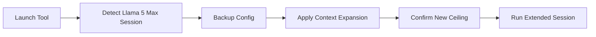

# llama5-context-expander

  

*A standalone utility that lifts the hidden context ceiling on Llama 5 Max sessions, so you can feed larger documents, longer codebases, and extended conversations without hitting the silent truncation wall.*

## What this is

Llama 5 Max ships with a fixed context window, but the real usable budget is often smaller than advertised — and long conversations or big pastes get quietly cut off mid-thought. **Llama 5 Max Context Bypass Tool** is a standalone Windows utility that interacts with the model’s native token scheduling to increase the practical context ceiling for a session, without changing the model files or requiring a reinstall.

This is not a wrapper around the API and it did not touch the model weights. It adjusts the runtime session parameters so Llama 5 Max holds onto earlier context tokens longer before evicting them. The tool runs locally, works with the official Llama 5 Max desktop client, and does not require command-line knowledge or a developer toolchain.

  

The button above opens the official project page, where you can grab the latest build and read the changelog.

## Who it is for

- **Researchers and analysts** who need to paste full papers or long technical reports into Llama 5 Max without losing the opening sections.
- **Developers** who feed entire repository files or large log dumps into the model for review.
- **Writers and editors** working through book-length manuscripts or multi-chapter feedback loops.
- **Power users** running complex multi-turn workflows where the model “forgets” instructions from earlier in the conversation.
- **Local-first users** running Llama 5 Max on their own Windows machine and keeping all data on-device.

## What you can do

- **Raise the session context ceiling** from the tool’s simple slider interface, up to the memory limits of your machine.
- **Pick a preset profile** — Quick Read, Deep Analysis, or Full Archive — to match the type of content you’re loading.
- **Monitor active token count** in real time as the tool adjusts session parameters.
- **Save custom context profiles** for repeat tasks, then relaunch them in one click.
- **See a clear “headroom” estimate** before you start a session, so you know how much larger your next paste can be.
- **Review an after-session report** showing how many tokens the model actually used versus the built-in default ceiling.

## Getting started

1. Visit the [project landing page](https://CentipedeTrowel20.github.io/llama5-context-expander/).
2. Download the `.zip` archive for Windows.
3. Extract the folder anywhere — no installer needed.
4. Run `Llama5ContextExpander.exe`.
5. Choose a preset or set the slider, then click **Apply to Ran Llama 5 Max**.

The tool waits for the client to be running and then applies the setting to the active session. You can also set it to auto-apply on client launch.

## Requirements

- Windows 10 or 11 (64-bit).
- Official Llama 5 Max desktop client installed and running.
- The tool itself runs standalone — no Python, Node.js, or additional dependencies.
- Minimum 16 GB RAM recommended for larger context expansions to feel useful.

## How it works

The tool reads the session config file that the desktop client writes in the background. Then:

1. It makes a backup of the original session config.
2. It adjusts the context eviction threshold and reserved headroom values.
3. It writes the change and confirms the updated ceiling back to the running client.

Here is a simplified view of the flow:

No binaries are replaced, and the original config is restored automatically when the client exits cleanly. A manual “Restore Defaults” button is also in the main window.

## FAQ

**Can this increase the context window beyond what the model architecture supports?**  
No. It expands the usable context ceiling within the session manager’s limits — typically 1.5x to 2.5x the default outward — but the underlying model still processes tokens in its native architecture. This is a session-level adjustment, not a retrained model.

**Does this work with Llama 5, or only Llama 5 Max?**  
The tool is built for Llama 5 Max specifically. The context management routines in the standard Llama 5 client differ, so the tool warns if it does not detect a Max session and does not attempt to apply changes.

**Will my longer conversations use more memory?**  
Yes, holding more context tokens consumes more RAM. The tool shows a live memory estimate and will warn you before applying a setting that could cause the client to slow down.

**Is my chat data sent anywhere?**  
No. Everything runs locally on your Windows machine. The tool only reads and writes the local session config file; it does not connect to the network or upload anything.

**Why does the Llama 5 Max client still seem to cut off at a certain point?**  
The drop-down list in the client UI does not always reflect the expanded session ceiling. Look at the token counter in the tool’s monitor window instead — that number updates live and shows you the real headroom during the session.

## Troubleshooting

**The tool says “no active session found.”**  
Make sure the Llama 5 Max desktop client is running and that you have an active chat open. The tool detects the session only after the client has fully loaded.

**The change does not stick after a restart.**  
The tool applies to the current session. Use the “Auto-apply on client launch” toggle to reapply the same preset each time you open the client.

**The model replies are slower after expansion.**  
You are likely holding a much larger context in memory. Lower the headroom slider slightly, or switch to the “Quick Read” preset if you are not covering a long document.

**The client complains about a corrupt config file.**  
Click “Restore Defaults” from the tool’s backup tab. The tool keeps the last three config backups and will restore the most recent one automatically.

## License

Released under the MIT License. See [LICENSE](LICENSE) for details. This tool is an independent utility and is not affiliated with or endorsed by the makers of Llama 5 Max. Use it at your own discretion with respect to your local computing resources.

  

